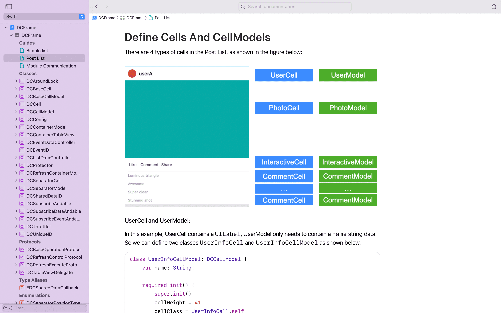

<p align="center">
  
</p>


<p align="center">
    <a href="https://travis-ci.org/github/bytedance/DCFrame">
        
    </a>
    <a href="https://cocoapods.org/pods/DCFrame">
      
    </a>
    <a href="https://cocoapods.org/pods/DCFrame">
        
    </a>
    <a href="https://cocoapods.org/pods/DCFrame">
        
    </a>
</p>

------

DCFrame is a UI combination frame, it can be easily achieved:

1. Assemble and manage complex UI modules; 
2. Reuse and migrate UI modules at no cost;
3. Communication between UI modules without coupling.

## Requirements

* Xcode 10.2+
* iOS 11.0+
* Swift 5.0+

## Installation

### Cocoapods

[CocoaPods](https://cocoapods.org) is a dependency manager for Cocoa projects. For usage and installation instructions, visit their website. To integrate DCFrame into your Xcode project using CocoaPods, specify it in your `Podfile`:

```ruby
pod 'DCFrame'
```

### Carthage

[Carthage](https://github.com/Carthage/Carthage) is a decentralized dependency manager that builds your dependencies and provides you with binary frameworks. To integrate DCFrame into your Xcode project using Carthage, specify it in your `Cartfile`:

```ruby
github "bytedance/DCFrame"
```

### Swift Package Manager

[Swift Package Manager](https://github.com/apple/swift-package-manager) is a tool for managing the distribution of Swift code. It’s integrated with the Swift build system to automate the process of downloading, compiling, and linking dependencies. To integrate DCFrame into your Xcode project using Swift Package Manager, add it to the dependencies value of your Package.swift:

```swift
dependencies: [
    .package(url: "https://github.com/bytedance/DCFrame.git", .upToNextMajor(from: "1.0.9"))
]
```

## Guides



We can quickly get started with DCFrame through the following guides:

* [Simple List](./Sources/DCFrame/DCFrame.docc/DCFrame/1_simple_list.md): How to create a simple list through DCFrame;
* [Post List](./Sources/DCFrame/DCFrame.docc/DCFrame/2_post_list.md): Through this example we learn to create a more complex combination list;
* [Module Communication](./Sources/DCFrame/DCFrame.docc/DCFrame/3_module_communication.md)：How to perform module event and data sharing in the post list;
* [More Examples](https://github.com/bytedance/DCFrame/tree/master/Example): We provide the same example as [IGListKit](https://github.com/Instagram/IGListKit), simply pull the git repo and run 'DCFrame.xcworkspace' in the 'Example' folder. 

## License

DCFrame is available under the MIT license. See the LICENSE file for more info.
